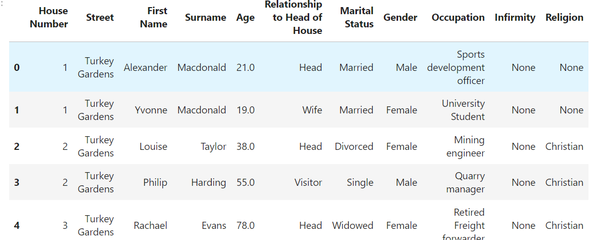
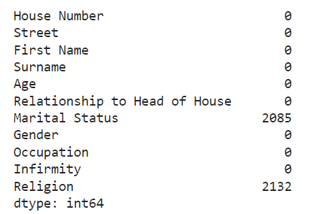
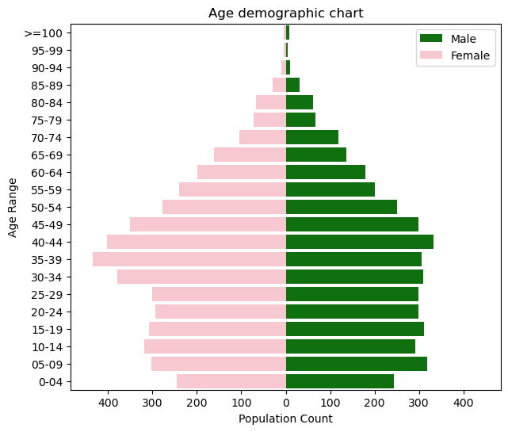

# UK Census 1881 Data Analysis for Urban Planning and Investment

## Overview
This project analyzes an 1881 UK census dataset to identify investment opportunities and provide development recommendations for a small town, focusing on demographics, religious affiliations, and housing needs.

## Motivation
The motivation behind this project is to analyze historical data from the 1881 UK census to uncover insights that can inform investment opportunities and development strategies for a small town. By understanding demographics, religious affiliations, and housing needs, we can make data-driven recommendations to improve community planning and resource allocation.

## Relevance
Analyzing historical census data is crucial for several reasons:
- **Historical Insights:** Provides a snapshot of historical societal structure and living conditions.
- **Urban Planning:** Helps in understanding past urbanization trends which can inform future development.
- **Investment Opportunities:** Identifies potential areas for investment based on demographic trends and housing needs.
- **Cultural Understanding:** Offers insights into the cultural and religious landscape of the past, which can be important for cultural preservation and education.

## Data Analysis Steps
### 1. Data Loading and Preprocessing
- Imported necessary libraries including pandas, seaborn, and matplotlib for data manipulation and visualization.
    ```python
    import pandas as pd
    import seaborn as sns
    import matplotlib.pyplot as plt
    %matplotlib inline
    ```
- Loaded the census data into a pandas DataFrame for analysis.
    ```python
    df_original = pd.read_csv("census20.csv")
    df = df_original.copy()  # Preserve original data
    ```


### 2. Data Cleaning
- Checked for missing values to ensure data quality and integrity.
    ```python
    df.isna().sum()
    ```


- Created a copy of the original data to preserve it for reference and made transformations on the copied data.
    ```python
    df_cleaned = df.dropna()  # Example of a cleaning step
    ```

### 3. Exploratory Data Analysis (EDA)
- **Overview of the Data:** Displayed the first few rows of the dataset to understand its structure and contents.
    ```python
    df.head()
    ```
- **Descriptive Statistics:** Calculated and visualized statistical measures to summarize the central tendency, dispersion, and shape of the dataset's distribution.
    ```python
    df.describe()
    sns.histplot(df['age'])
    plt.show()
    ```

### 4. Demographic Analysis
- Analyzed age distribution, gender ratios, and other demographic indicators.
    ```python
    sns.countplot(x='gender', data=df)
    plt.show()
    ```
- Visualized demographic data to highlight key trends and patterns within the population.
    ```python
    sns.kdeplot(df['age'], shade=True)
    plt.show()
    ```


### 5. Religious Affiliations
- Investigated the religious composition of the population.
    ```python
    df['religion'].value_counts()
    ```
- Identified major religious groups and their proportions in the dataset.
    ```python
    sns.countplot(y='religion', data=df)
    plt.show()
    ```
- Created visualizations to depict the religious landscape of the town.
    ```python
    df['religion'].value_counts().plot(kind='pie', autopct='%1.1f%%')
    plt.show()
    ```

### 6. Housing Needs Analysis
- Examined housing conditions and occupancy rates.
    ```python
    df['housing_type'].value_counts()
    ```
- Assessed the adequacy of housing facilities in relation to the population size and structure.
    ```python
    sns.barplot(x='housing_type', y='occupancy_rate', data=df)
    plt.show()
    ```

## Findings and Recommendations
- **Demographics:** The town exhibited a diverse age distribution with significant proportions of working-age individuals and children, indicating potential for workforce development and educational investments.
- **Religious Affiliations:** The religious data revealed a majority affiliation with a particular religion, suggesting the need for community spaces and services catering to this group.
- **Housing Needs:** Identified gaps in housing availability and suggested targeted investments in residential construction to meet the growing population's needs.

## Conclusion
The analysis of the 1881 UK census data provided valuable insights into the town's demographics, religious affiliations, and housing needs. These insights are critical for making informed decisions about urban planning and investments. Historical data, when analyzed effectively, can serve as a powerful tool to guide future development and enhance the quality of life for community residents.

## How to Run the Project
To replicate this analysis:
1. Clone the repository from GitHub.
2. Ensure all necessary libraries are installed (`pandas`, `seaborn`, `matplotlib`, etc.).
3. Run the Jupyter Notebook to load the data and execute the analysis steps.
4. Review the visualizations and findings to understand the data insights and recommendations.

This project demonstrates the importance of data analysis in uncovering valuable historical insights and informing future development strategies. It serves as a testament to the power of data in driving informed decision-making and community planning.
